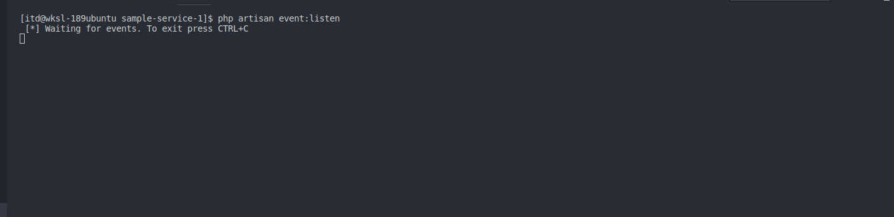
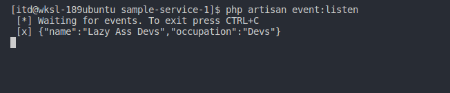

# Sample Service 1

## Getting Started
Sample service built in lumen. For now, this is the receiver. see [sample-service-2](https://github.com/lazy-ass-devs/sample-service-2) for the publisher example

### Prerequisites

What things you need to install the software and how to install them
* lumen
* composer
* RabbitMQ

### Installing

copy the repository 
```
git clone
```

install all the dependencies
```
composer install
```

## Running the tests

Run the event listener
```
php artisan event:listen
```


After that... make sure to send the [sample-service-2](https://github.com/lazy-ass-devs/sample-service-2) project and see the changes


## How to Laravel Way
- Create a artisan command and make it listen to incoming RabbitMQ queues https://laravel.com/docs/5.8/artisan#writing-commands
    
    Check the [**app/Console/Commands/EventListener.php**, **app/Console/Kernel.php**] files for the implementation.

- Create Projector and add it into ProjectorProvider
  1.) First create projector class and put it in **app\Projectors\Projector**     directory
  ```php
    namespace App\Projectors\Projector;
    
    use App\Projectors\Projector;
    use PhpAmqpLib\Message\AMQPMessage;
    
    final class HelloProjector implements Projector {
        
        public function name() : string {
            return 'HelloProjector';
        }
        
        public function project(AMQPMessage $message): bool{
            echo ' [x] ', $message->body, "\n";
            return true;
        }
    }
  ```

  2.) Navigate through ProjectProvider.php then add the namespace of class    HelloProjector
    ```php
    private $projectors = [
        'App\Projectors\Projector\HelloProjector'
    ];
    ```
    3.) Check, if its already binded. run **php artisan event:listen**
    

